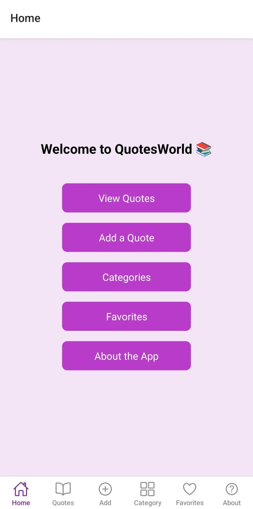
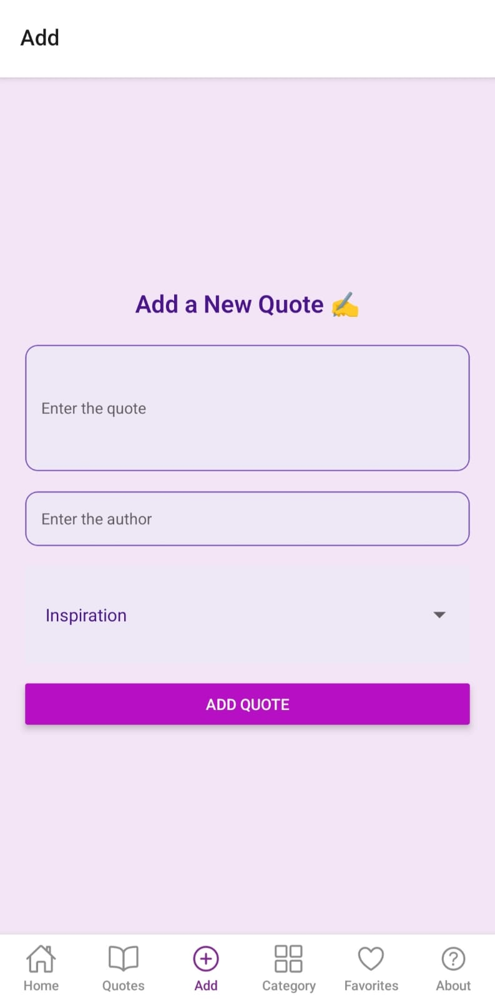
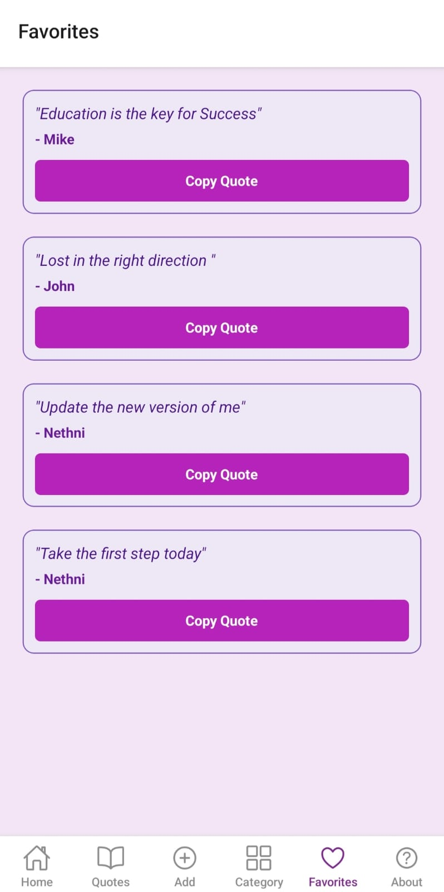
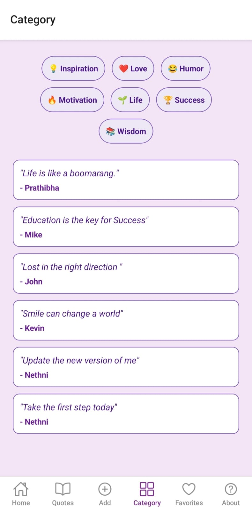
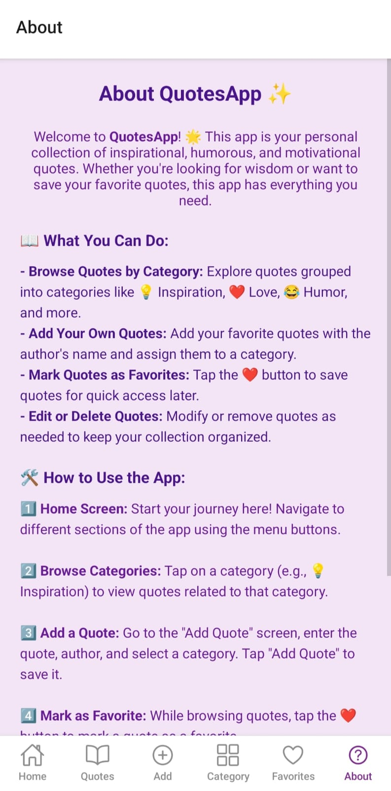

# Quotes Collection Mobile App

A simple and user-friendly mobile application that allows users to add, categorize, and save their favorite quotes. This app helps users organize inspirational and meaningful quotes in one place.

---

## Features
- Add new quotes  
- Categorize quotes  
- Save favorite quotes  
- View organized quote collections  
- Simple and clean user interface  

---

## Technologies Used
- React Native (Expo)  
- JavaScript  

---

## Project Structure
- screens/ – App screens (Home, Add Quotes, Categories, Favorites, About)  
- components/ – Reusable UI components  
- assets/ – Images and icons  

---

## How to Run the Project

1. Install dependencies:
npm install

2. Start the project:
npx expo start

3. Run on:
- Android Emulator (Android Studio)  
- Expo Go mobile app  

---

## Screenshots

  
  
  
  
  

---

## Future Improvements
- Search quotes feature  
- Cloud storage integration  
- User authentication  
- Dark mode support  

---

## Author
Prathibha Dissanayake  
GitHub: https://github.com/PrathiAsheka
